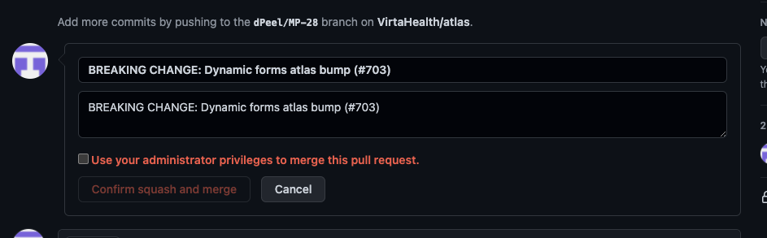

# Atlas | A monorepo for frontend development at Virta


- [Atlas | A monorepo for frontend development at Virta](#atlas--a-monorepo-for-frontend-development-at-virta)
  - [What is this?](#what-is-this)
    - [Why is it called Atlas?](#why-is-it-called-atlas)
    - [How does it work?](#how-does-it-work)
  - [Quickstart](#quickstart)
  - [Unit Testing](#unit-testing)
  - [Releasing](#releasing)
    - [Conventional Commits](#conventional-commits)
      - [Most common commit types](#most-common-commit-types)
      - [Other Available Conventional Commit Types](#other-available-conventional-commit-types)
    - [Releasing Content Package](#releasing-content-package)
  - [Tooling](#tooling)
    - [Makefile](#makefile)
    - [Yarn Scripts](#yarn-scripts)
    - [Stylelint](#stylelint)
  - [React-Native First Patterns](#react-native-first-patterns)
    - [Platform Specific Implementations](#platform-specific-implementations)
      - [Testing](#testing)
    - [Styling](#styling)
  - [Non-Atlas Development](#non-atlas-development)
    - [Preferred Workflow](#preferred-workflow)
    - [Linking From Other Projects (Spark, EP, PA)](#linking-from-other-projects-spark-ep-pa)
    - [Working with Mobile](#working-with-mobile)
  - [Mobile Storybook](#mobile-storybook)
  - [Appendix](#appendix)
    - [Useful Commands](#useful-commands)
    - [Mobile Specific Useful Commands](#mobile-specific-useful-commands)

<small><i><a href='http://ecotrust-canada.github.io/markdown-toc/'>Table of contents generated with markdown-toc</a></i></small>

## What is this?

Atlas is a monorepo that will contain the source code for most frontend projects at Virta.

### Why is it called Atlas?

Mostly to poke fun at some of Virta's existing engineering initiatives, namely Apollo, Athena, and Elixir. Though we did also attempt to choose a name that made some sense - in the same vein as Atlas, the Titan, supports the heavens, Atlas, the monorepo, supports app development at Virta. It's a stretch for sure.

### How does it work?

Atlas is a monorepo utilizing [yarn workspaces](https://classic.yarnpkg.com/en/docs/cli/workspaces/). This means you never have to leave the root directory to work with packages in the project and you only have to install dependencies once: from the root directory using `yarn install`.

`yarn install` automagically sym links project dependencies that are in the project to each other. For example, @virtahealth/components will automatically be symlinked to @virtahealth/utils, rather than using the NPM registry version. This is the default behavior of `yarn install` when there is a "workspaces" property present in the package.json.

## Quickstart

First, make sure you're using Node 12.13.0 or greater. You can your Node version by running:

```sh
$ node --version
```

If you're not using Node 12.13.0 or greater, we recommending installing it with `nvm`

```sh
$ nvm install 12.13.0
```

Install [yarn](https://classic.yarnpkg.com/lang/en/) if it's not already installed.

```sh
$ brew install yarn
```

Next, install all dependencies.

```sh
$ yarn install
```

Then run `make` to build the initial dist directories in all packages.

```sh
$ make
```

From here, you'll likely want to begin component developing using storybook. Run:

```sh
$ yarn start
```

This will start up storybook, as well as build styles, components, experiences, and utils. Storybook will pick up any changes you make to styles, components, experiences, or utils and will hot reload in 20-40 seconds or so.

Happy developing!!

## Unit Testing

To run unit tests for specific project, run `yarn test:{package-name}`, for example:

```sh
$ yarn test:components
```

if you want to run all unit tests in atlas, run:

```sh
$ yarn test:all
```

## Releasing

Atlas uses [lerna](https://lerna.js.org/), a tool for managing JS monorepos, to increment package versions and to publish to our private npm registry.

On merge into master `lerna publish` will be run via CircleCI. `lerna publish` decides what version to update all the packages to (patch, minor, or major incremented), it makes those updates with a git commit, and then publishes the new version to npm! No version maintenance necessary.

**Note:** the docs and content subpackages are excluded from this flow for being special cases.

The exact command we run is `lerna publish --no-private --conventional-commits --yes`

- --no-private: content and docs packages are private, adding no-private means if changes only occur in one of those projects we do not update versions of any packages or publish.
- --conventional-commits: For lerna to understand what aspect of semver should be updated we must structure our PR messages to the [conventional commits specification](https://www.conventionalcommits.org/en/v1.0.0/). See next section for more info.
- --yes: usually there is an "are you sure" prompt, this arg skips it.

### Conventional Commits

We must use conventional commit format PR messages to have versioning be automated by lerna. Lerna uses the [angular convention](https://github.com/conventional-changelog/conventional-changelog/tree/master/packages/conventional-changelog-angular) of conventional commits by default.

Conventional commits are a way to structure of you PR git messages to specify what kind of change you've introduced to the project.

For instance, writing `fix: i fixed that bug` would result in `lerna publish` incrementing the patch version by one, e.g. 1.0.0 => 1.0.1. If there are multiple commits that are being evaluated then the more larger change segment (major > minor > patch) will be the one incremented.

```
<type>: <short summary>
```

- Summary in present tense. Not capitalized. No period at the end.

#### Most common commit types

- **chore** — doesn't not update package version (good for changes .gitignore, readme, etc.).
- **fix** — to indicate a bug fix (PATCH) ex . v0.0.1.
- **feat** — to indicate a new feature (MINOR) ex. v0.1.0.
- **docs** — for updates to the documentation.
- **BREAKING CHANGE** — regardless of type, indicates a Major release (MAJOR) ex. v1.0.0.

`BREAKING CHANGE` is special in that it's expected in the footer of the commit message:



If you do not provide a conventional commit, the default of lerna is to increment the patch version.

#### Other Available Conventional Commit Types

- **build:** Changes that affect the build system or external dependencies (example scopes: gulp, broccoli, npm).
- **ci:** Changes to our CI configuration files and scripts.
- **perf:** A code change that improves performance.
- **refactor:** A code change that neither fixes a bug nor adds a feature.
- **style:** Changes that do not affect the meaning of the code (white-space, formatting, missing semi-colons, etc).
- **test:** Adding missing tests or correcting existing tests.

### Releasing Content Package

Changes in the content directory will be published to Sanity on merges into `master`.

## Tooling

In order develop efficiently, the repo also includes some tooling to handle common tasks.

### Makefile

The repo includes a `Makefile` to generate the packages and handle some of the more common tasks that yarn does not. Just running `make` will build all the packages. Running `make {pacakage}` will build the package and any dependencies of the package. `make clean` removes all the built packages.

### Yarn Scripts

Go to the scripts section of the root package.json to see how the yarn scripts are set up. They are mostly just shorthand for yarn workspace commands, e.g. `"test:components": "yarn workspace @virtahealth/components test"`.

### Stylelint

You can run `yarn stylelint` in this repository to get some basic info about styles that may be incompatible with React Native.

At the time of writing, the tool works but it is very noisy. Stylelint is currently in the process of changing how parsers work but a new parser hasn't been created for `styled-components`. This causes the Stylelint CLI to throw a warning on every file saying, "When linting something other than CSS, you should install an appropriate syntax...." This warning may be ignored and the true errors will be found below those warnings

## React-Native First Patterns

### Platform Specific Implementations

Some functionality requires a platform specific solution. React Native offers a standard convention to
enable this functionality `MyComponent.platform.js`. Our combination of Typescript and React Native Web
conforms to this but also requires a few additional conventions.

When a platform specific component is required, the implementation files need to be included in their own
directory. To enable efficient handling of Typescript, the folder should contain and `index.d.ts` file with
the appropriate shape definitions. The web component should be defined in `index.tsx?` and other platform
specific components can use the standard React Native conventions.

#### Testing

The standard React Native testing conventions apply but we've replicated some of them here so you don't have
to search.

Mocking a platform specific file:

```
jest.mock("./Uploader", () => ({
  __esModule: true,
  default: "Uploader"
}));
```

Both the `__esModule` and `defualt` are needed if you are exporting a default component.

### Styling

The base Atlas component library and styling package are heavily themed based. Since the theme needs to be
able to work with React Native, themes should be unitless in most cases. If our styling library,
`styled-components` requires a unit, include the unit when declaring the css.

In the theme:

```
const fontSize = 16
```

In the component:

```
fontSize: ${theme.fontSize}px
```

## Non-Atlas Development

While the easiest experience is to create an application entirely within Atlas. This may not be possible at
all times and the following workflows may give some initial ideas on how to work within another application.

### Preferred Workflow

The preferred workflow is to develop within Atlas using Storybook or other tools. Once an experience is in
good shape you can publish the experience and any corresponding package changes. Adding the experience is then
just updating the `npm` version.

This may make "minor touchups" more difficult but getting us to this workflow also helps get used to multiple
platform development while also preventing your local machine from becoming a mess.

### Linking From Other Projects (Spark, EP, PA)

Sometimes you'll want to link another project directly to atlas so you can develop in both projects at the same time. This is as simple as creating the link, and using the link. If you want to remove the link, just re-install (`npm install` or `yarn install`, depending on the project) and that link will be removed. Simple!

Notes:

- linking does not currently work with our react native mobile application, this will just work for web apps.
- if your project's FE assets in tilt/docker_dev, like run-pa-assets or run-plp-assets, job is restarted, you'll have to run these link commands again, as restarting those jobs will run an npm install or yarn install.

To link a package, run:

```sh
$ yarn link:components # alias for yarn workspace @virtahealth/components link
```

Then go to the project that is consuming it (e.g. `cd ~/code/program_lead_portal_py`) and run:

```sh
$ yarn link @virtahealth/components
```

That's it! Repeat similar steps if you want to link experiences, utils, or styles.

To remove the links just run install again. For example, in ~/code/program_lead_portal_py, run:

```sh
$ npm install
```

### Working with Mobile

Tilt (`docker_dev`) has a target that watches for changes in Atlas and when any are detected it runs the `make copy-files-to-pa-ios` command from Atlas to copy over all changes to the mobile app. The development workflow is:

- `rocket run mobile-sync-atlas-src` from `docker_dev` to start the copy target. It will execute on startup and then any time a file changes within the `@virtahealth` directory
- run `yarn workspace @virtahealth/styles start` to watch for style changes and compile them to the `/dist` folder
- Run the metro bundler in the mobile app by running `yarn start` from within the `participant_app_ios` directory

That is it! You will see your Atlas changes in the mobile app fairly quickly as you make modifications.

## Mobile Storybook

Currently storybook can be run on mobile. As of the time of writing (11/16/21) it is not the most ideal setup but it can be done. Follow these steps to get it up and running:

1. Run `yarn` or `yarn install` after pulling the latest repo
2. From the root of the repo run `yarn docs:mobile:pods` and wait for that to complete
3. Go into the `package.json` of each package and update the `main` entrypoint to point to the src folder
   1. This would typically mean updating `dist/index.js` to `src/index.ts`
   2. This is the step that is less then ideal at the moment. This step should eventually be removed
   3. DO NOT CHECK IN THE CHANGES TO THE PACKAGE.JSON!!
4. From the root of the repo run `yarn docs:mobile`
5. From another terminal tab/window run `yarn docs:mobile:ios` or `yarn docs:mobile:android`

## Appendix

### Useful Commands

See the root package.json for all commands under `scripts`. You'd run `yarn {name-of-script}` to run the script.

- `yarn start` - start storybook and re-build styles, experiences, components and utils when anything changes
- `yarn start:content` - starts sanity
- `yarn test:all` - run all unit tests (experiences, components, utils)
- `yarn test:experiences` - run unit tests for experiences
- `yarn test:experiences --watch` - run unit tests for experiences in watch mode
- `yarn test:components` - run unit tests for components (same structure test:{package} for other packages)
- `yarn test:components --watch` - run unit tests for components in watch mode
- `yarn build:experiences` - build assets for experiences once (same structure build:{package} for other packages)
- `yarn build-prod:experiences` - build assets for experiences with prod config once
- `yarn link:all` - create sym links for all packages so that they can be used for development in other projects
- `yarn unlink:all` - unlink all symlinks from other projects

### Mobile Specific Useful Commands

- `make copy-files-to-pa-ios` - Copy over Atlas changes to the mobile `node_modules`
